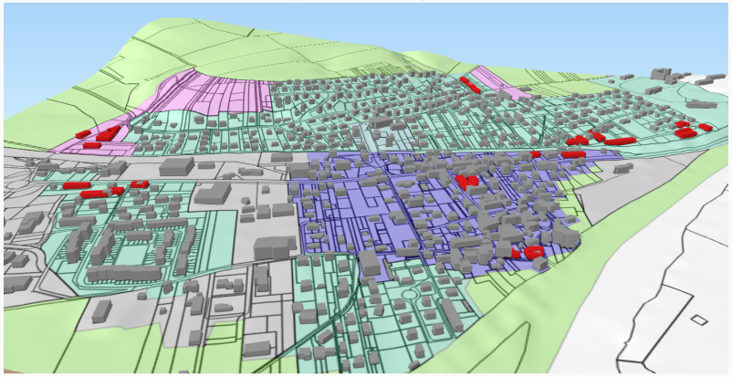

# ArtiScales.github.io
The spatial simulation platform ArtiScales supports the integration of regional and local planning policies that aim to control residential development. It integrates two models: [MUP-City](https://sourcesup.renater.fr/mupcity/en.html) and [SimPLU3D](https://simplu3d.github.io/).

MUP-City simulates scenarios of residential development for an entire urban region given a set of planning rules. The first rule ensures that the pattern of cells worth urbanising is fractal. The other planning rules take account of the proximity of roads, accessibility of shops and services, accessibility to public transport, proximity of open spaces, and the presence of areas that cannot be built on. The identification of cells worth urbanising takes the form of a raster map of potential building cells, each characterised by the worth of urbanising them. How worthwhile it is for a cell to be urbanised ranges from zero to one.

SimPLU3D simulates the building constructibility within a land parcel or a group of parcels by generating 3D buildings that respect the rules of the local urban masterplan (in French, *Plan Local d'Urbanisme - PLU*) as well as other morphological constraints.

# Example of simulation result # In grey colour: existing building; in red colour: building constructed in the course of the simulation.

**Process of a simulation with ArtiScales**

ArtiScales has been created by [Maxime Colomb](http://recherche.ign.fr/labos/cogit/english/cv.php?nom=Colomb) (as part of his PhD thesis), [Mickaël Brasebin](http://recherche.ign.fr/labos/cogit/english/cv.php?prenom=&nom=Brasebin), [Julien Perret](http://recherche.ign.fr/labos/cogit/english/cv.php?prenom=&nom=Perret), and [Cécile Tannier](http://thema.univ-fcomte.fr/en/page_personnelle/ctannier).
